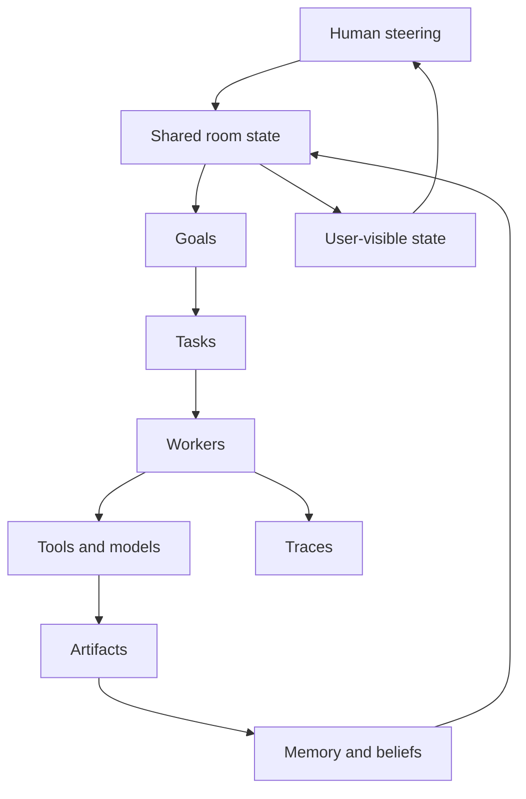

# Agent OS Markdown

> A portable markdown spec pack for building durable, inspectable AI agent systems.

Agent OS Markdown is a repo of plain `.md` operating documents for teams building agents that do real work: goals, workers, memory, tools, permissions, traces, artifacts, and human steering.

The core idea is simple:

> A capable agent is not just a model loop. It is a stateful operating system around the model.

This pack is intentionally framework-neutral. Use it with a local script, a hosted agent runtime, a voice room, a coding harness, a browser agent, or a multi-agent workflow engine.

## What This Gives You

- A constitution for agent behavior.
- A world model for rooms, humans, devices, tools, and work.
- A loop model for observe -> plan -> act -> verify -> remember.
- A harness model for schedulers, workers, retries, cancellation, and traces.
- A context model for what the agent should know now versus store durably.
- A permission and budget model for tool use.
- Eval templates for proving the system works instead of trusting demos.

## The Stack



## The Contract

Agent OS systems should be able to answer these questions at any moment:

- What is the active goal?
- What parallel goals exist?
- Which workers are queued, running, completed, blocked, failed, canceled, or retried?
- What artifacts were produced?
- What beliefs were learned, from which source, at what confidence?
- What policy gates were applied?
- What budget was consumed?
- What failed, and why?
- What can the user inspect, retry, cancel, or change?

If the system cannot answer those questions, it is not yet an agent operating system. It is a transcript with tools.

## File Map

| File | Purpose |
|---|---|
| [soul.md](soul.md) | Operating constitution for durable agency |
| [skills.md](skills.md) | Skill and worker capability catalog |
| [world.md](world.md) | World model: humans, agents, tools, rooms, time, state |
| [loop.md](loop.md) | Loop engineering: observe, interpret, plan, act, verify |
| [harness.md](harness.md) | Runtime harness: scheduler, reducer, workers, traces |
| [context.md](context.md) | Context engineering and prompt state boundaries |
| [memory.md](memory.md) | Working, episodic, semantic, and procedural memory |
| [goals.md](goals.md) | Goal graph semantics and lifecycle |
| [workers.md](workers.md) | Worker lifecycle and retry/cancel contracts |
| [delegation.md](delegation.md) | When and how to parallelize work |
| [permissions.md](permissions.md) | Tool authority and human approval boundaries |
| [budget.md](budget.md) | Cost, time, worker, and risk budgets |
| [visibility.md](visibility.md) | What internal state must be visible to users |
| [interrupts.md](interrupts.md) | Mid-flight steering and retargeting behavior |
| [collaboration.md](collaboration.md) | Human-agent and agent-agent room behavior |
| [artifact.md](artifact.md) | Durable output definitions |
| [evals.md](evals.md) | Capability tests and live verification |
| [failure-modes.md](failure-modes.md) | Known failure patterns and mitigations |
| [trace-schema.md](trace-schema.md) | Standard trace event vocabulary |
| [readiness.md](readiness.md) | Checklist before claiming a system is real |

Templates live in [templates/](templates/).

## How To Use

1. Copy the files into your repo.
2. Edit `soul.md` to match your product boundary.
3. Define your real skills in `skills.md`.
4. Implement the state objects from `harness.md`, `goals.md`, and `workers.md`.
5. Add trace events from `trace-schema.md`.
6. Build the UI from `visibility.md`.
7. Run the tests from `evals.md` and `readiness.md`.

## Design Principle

Models can reason and write. The harness must own authority.

That means the model may propose actions, plans, and artifacts, but the system decides:

- whether the action is allowed
- whether budget exists
- whether the user approved it
- whether the worker is stale
- whether the result satisfies the goal
- whether the result can be committed

## Minimal State Shape

```ts
type AgentOsRoom = {
  state: ConversationState;
  policy: AgentOsPolicy;
  goals: Goal[];
  tasks: Task[];
  workers: WorkerRun[];
  artifacts: Artifact[];
  world: {
    beliefs: Belief[];
  };
  traces: TraceEvent[];
};
```

## License

MIT. Use it, fork it, adapt it, and ship better agent systems.
