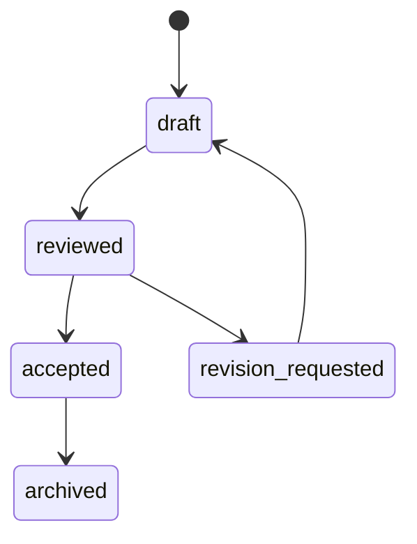

# Artifacts

Artifacts are durable outputs. They are the proof that work happened.

Transcript is not enough. A worker that completes meaningful work should usually produce or update an artifact.

## Artifact Types

- memo
- plan
- research digest
- code patch
- checklist
- timeline
- chart
- decision log
- eval result
- issue report
- deployment report

## Artifact Schema

```ts
type Artifact = {
  id: string;
  goalId: string;
  workerId?: string;
  kind: string;
  title: string;
  content: string;
  sources?: Source[];
  createdAt: number;
  updatedAt?: number;
};
```

## Artifact Requirements

An artifact should include:

- title
- purpose
- source goal
- source worker
- content
- source list when external facts are used
- timestamp

## Artifact Lifecycle



## Artifact Editing

Editing an artifact should:

- preserve history where possible
- trace the edit
- name the source worker or human
- avoid silently overwriting accepted decisions

## Artifact Verification

Before calling work complete:

- artifact exists
- artifact addresses the goal
- constraints are represented
- sources exist for current facts
- unsupported claims are marked
- next actions are clear where needed

## Rule

If work matters, it should leave an artifact.
