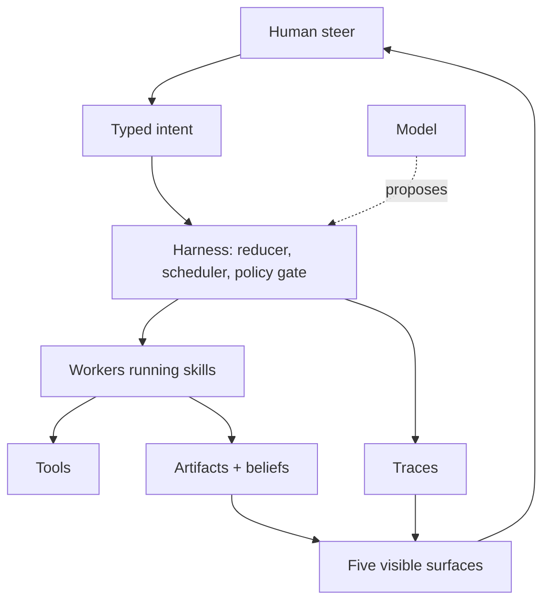

# Architecture

This repository has no runtime, so "architecture" here means two things: the
architecture of the system the documents describe, and the structure of the
document set itself.

## The system the pack describes

One idea holds the whole thing together, stated in `README.md` and again in
`harness.md`:

> The harness owns truth. The model owns proposals.

A language model can plan, write, and suggest. It is never the component that
decides whether an action is permitted, whether budget remains, whether a worker
is stale, or whether work is finished. A separate runtime — the harness — decides
all of that, and every document in the pack is an elaboration of some part of
that split.

The dotted line is the point. The model proposes into the harness; it does not
reach tools, artifacts, or state directly.

## Four boundaries the pack refuses to blur

| Boundary | Enforced in | What it stops |
|---|---|---|
| Proposal vs. decision | `harness.md` | a model authorising its own tool call |
| Transcript vs. state | `soul.md`, `memory.md` | work that exists only as words |
| Claimed done vs. verified done | `loop.md`, `artifact.md` | "done" with no artifact behind it |
| Live vs. stale worker | `harness.md` `## Commit Guard` | a cancelled job committing late |

## Where each type is defined

Exactly one file owns each type. This was not true before the human-readiness
wave — `WorkerRun` had two conflicting definitions.

| Type | Owner |
|---|---|
| `AgentOsRoom` | `README.md` |
| `AgentOsPolicy` | `harness.md` |
| `Goal` | `goals.md` |
| `WorkerRun` | `workers.md` |
| `Artifact` | `artifact.md` |
| `Belief` | `memory.md` |
| `TraceEvent` | `trace-schema.md` |
| `World` | `world.md` |
| `PermissionState` | `permissions.md` |

`AgentOsRoom` holds the work: goals, tasks, workers, artifacts, traces, policy.
`World` holds what the room operates *on*: humans, agents, devices, tools,
beliefs, risks, constraints. Artifacts belong to the room, not the world — a
point `world.md` now states explicitly because the two definitions previously
disagreed.

`ConversationState` and `Task` are named in `AgentOsRoom` and never defined; see
[CONCERNS.md](CONCERNS.md).

## The document set

The twenty documents form a rough dependency order rather than a flat set. That
order is walked in [`docs/START_HERE.md`](../START_HERE.md):

    entry -> constitution + types -> harness -> skills + gates
      -> durable writes -> visible surfaces -> failures -> tests

Two documents are hubs that others link into:

- **`trace-schema.md`** is the single event vocabulary. No other file defines
  events; `delegation.md` names the ones it emits and links here.
- **`failure-modes.md`** is the single failure catalogue. `world.md`, `loop.md`,
  `context.md` and `interrupts.md` keep only the failures unique to their own
  subject and link here for the rest.

Both were forked before the human-readiness wave. Keeping them single-source is
the main structural invariant of the document set.
