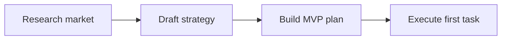

# Goals

Goals are durable units of intention. They are not just messages.

An Agent OS must preserve goals across turns, workers, devices, retries, and interruptions.

## Goal Schema

```ts
type Goal = {
  id: string;
  title: string;
  kind: string;
  status: "active" | "completed" | "blocked" | "canceled";
  priority: number;
  sourceText: string;
  parentGoalId?: string;
  createdAt: number;
  updatedAt: number;
};
```

## Goal Operations

### Create

Add a new goal when the user asks for new work.

Signals:

- "also"
- "while you do that"
- "start another"
- "can you also"
- "in parallel"

### Replace

Replace when the user explicitly changes direction.

Signals:

- "instead"
- "stop doing that"
- "new goal"
- "change the goal to"
- "forget that"

### Constrain

Add a constraint without replacing the goal.

Signals:

- "make sure"
- "keep it under"
- "do not"
- "only use"
- "avoid"

### Correct

Patch state when the user says the system is wrong.

Signals:

- "no"
- "that's wrong"
- "you missed"
- "I meant"
- "not that"

### Complete

Mark complete only when verification passes.

Completion evidence may include:

- artifact exists
- tests passed
- user accepted
- worker verifier passed
- live flow verified

### Block

Mark blocked when progress requires missing permission, missing context, unavailable tool, or exhausted budget.

## Goal Graph

Goals may have dependencies:



## Goal Conflict Handling

When goals conflict:

1. Preserve both in state.
2. Mark the conflict.
3. Ask for resolution only if acting would be risky.
4. Otherwise proceed on non-conflicting work.

## Rule

Never destroy a goal because a newer message arrived. Classify the message first.
