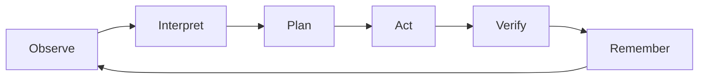

# Loop Engineering

Agent systems are made of loops. Reliable systems name the loops, bound them, and make each transition visible.

## Primary Loop

## Loop Steps

### 1. Observe

Collect current state:

- human input
- room state
- active goal graph
- policy
- worker statuses
- recent artifacts
- relevant beliefs
- tool results

Observation must be bounded. The agent should not ingest the whole world by default.

### 2. Interpret

Classify the new input:

- new goal
- add parallel goal
- replace goal
- constraint
- correction
- approval
- question
- cancellation
- retry request
- status request

Interpretation should produce typed intent, not only prose.

### 3. Plan

Convert intent into state transitions:

- create goals
- split tasks
- choose skills
- assign workers
- set dependencies
- reserve budget
- request permission if needed

The plan is a proposal until committed by the harness.

### 4. Act

Run allowed actions:

- deterministic reducer step
- model call
- tool call
- worker schedule
- artifact write
- trace write

Actions should be idempotent where possible and guarded against stale commits.

### 5. Verify

Check whether the action achieved the intended state:

- schema validation
- artifact exists
- source list exists
- tests pass
- browser flow works
- logs are clean
- user-visible state updated

A model saying "done" is not verification.

### 6. Remember

Write durable memory only after verification:

- artifact
- belief
- decision
- failure mode
- eval case
- user preference

Memory should keep source, confidence, and timestamp.

## Loop Types

### Foreground Loop

Handles live conversation and turn-taking.

### Intent Loop

Turns human steering into typed state transitions.

### Worker Loop

Moves work from queued to running to terminal state.

### Verification Loop

Checks outputs across the real boundary the user cares about.

### Memory Loop

Consolidates durable lessons from artifacts, traces, and corrections.

## Loop Control

Every loop needs:

- stop condition
- max attempts
- budget
- trace events
- retry policy
- stale write guard
- user-visible state

## Bad Loop Smells

- unbounded "think more" calls
- transcript-only memory
- repeated acknowledgements
- silent retries
- workers that cannot be canceled
- stale workers that still commit
- no visible blocked state
- no external verification

## Rule

Loops should continue because state requires it, not because the model keeps talking.
