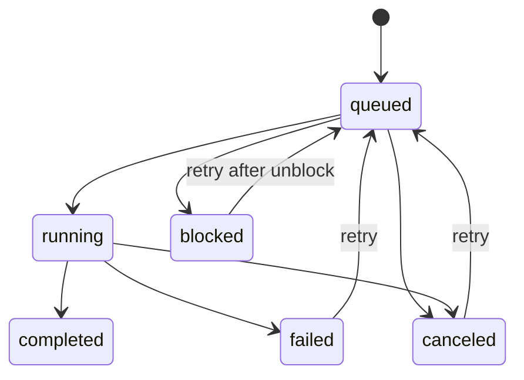

# Workers

Workers are scheduled attempts to perform bounded work.

They give the system parallelism, auditability, cancellation, and retry without relying on the foreground conversation loop.

## Worker Lifecycle



## Worker Schema

```ts
type WorkerRun = {
  id: string;
  goalId: string;
  taskId: string;
  kind: string;
  title: string;
  status: "queued" | "running" | "completed" | "failed" | "blocked" | "canceled";
  model?: string;
  summary?: string;
  error?: string;
  retryOf?: string;
  attempt: number;
  createdAt: number;
  updatedAt: number;
  startedAt?: number;
  completedAt?: number;
};
```

## Queued

The worker exists but has not started.

Required:

- skill selected
- policy checked or pending check marked
- budget reserved or reservable

## Running

The worker is executing.

Required:

- startedAt timestamp
- trace event
- stale completion guard

## Completed

The worker finished and committed output.

Required:

- artifact or explicit no-output reason
- summary
- completedAt timestamp
- trace event

## Failed

The worker attempted work but hit an error.

Required:

- error reason
- retry eligibility
- trace event

## Blocked

The worker cannot start because a precondition is missing.

Common reasons:

- permission disabled
- budget exhausted
- required input missing
- dependency incomplete
- tool unavailable

Blocked is not failed. It is actionable state.

## Canceled

The user or harness stopped the worker.

Required:

- old attempt cannot commit later
- retry creates a new attempt
- trace event remains visible

## Retry

Retry should create a new worker or new attempt, linked to the original.

Rules:

- do not erase the old failed or blocked record
- copy relevant context
- re-check policy
- consume budget only when actually scheduled
- preserve retryOf and attempt

## Rule

Every worker must end in a visible terminal state.
